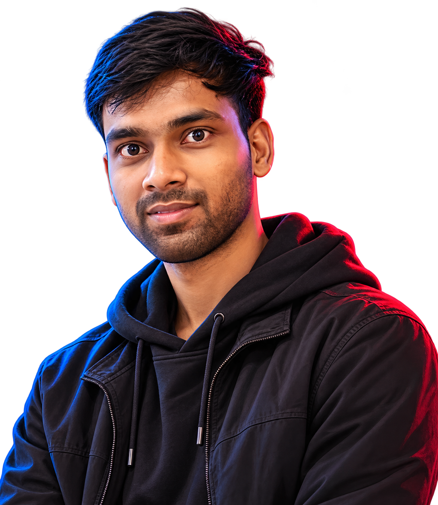
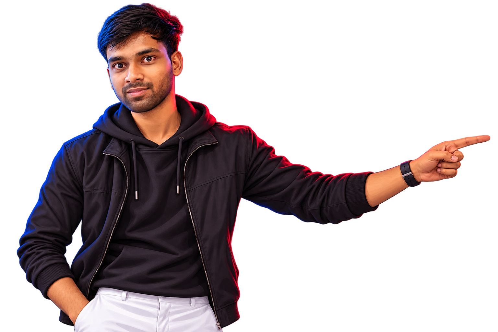

<div align="center">

# Vaibhav Chaurasiya

### Software Developer · Full-Stack · AI Applications

I build web applications, APIs and AI-powered products with a focus on  
**clean implementation, debugging, usability and continuous learning.**

<p>
  <a href="https://github.com/Vaibhav-Chaurasiya">
    
  </a>
  <a href="https://www.linkedin.com/in/vaibhav-chaurasiya/">
    
  </a>
  <a href="mailto:vaibhavchaurasiya50@gmail.com">
    
  </a>
</p>



</div>

---

## About

I'm a Software Developer from **Noida, India**, with hands-on experience across full-stack development, REST APIs, application debugging and technical troubleshooting.

I completed my **BCA (2022–2025)** and am currently pursuing an **MCA (2025–2027)**.

My approach is simple:

> **Build → Test → Debug → Improve → Ship**

I prefer learning technologies by using them to solve real problems rather than collecting tools on a resume.

### What I work on

- Full-stack web applications
- REST API integration and authentication
- React-based interfaces and backend services
- MongoDB / MySQL data-driven applications
- Generative AI and RAG-based applications
- API testing, debugging and troubleshooting
- Deployment and Git-based development workflows
- Practical automation and developer tooling

---

## Selected Work

### PrepMate AI — AI Interview Coach

An AI-powered interview preparation platform built around practical interview practice.

**What it does**
- Role-based interview simulations
- Voice feedback
- Resume ↔ Job Description matching
- Generative AI powered workflows

**Live:** https://interview-coach-kappa.vercel.app/

---

### AI Lawyer — GenAI + RAG Legal Assistant

An AI application focused on document analysis and question answering.

**What it does**
- Document upload and processing
- Legal document summarization
- Retrieval-Augmented Generation (RAG)
- LLM API integration
- Case-related question answering

**Live:** https://ai-lawyer-mu.vercel.app/

---

### Smart Human Less Printer — IoT System

A Raspberry Pi based self-service printing system designed around automated document handling.

**Key areas**
- Secure document upload
- UPI / Card payment integration
- Automated printing
- Real-time monitoring

---

## Engineering Experience

### Web Developer — SuPav Solutions
**Oct 2025 – Mar 2026 · Greater Noida**

- Built and maintained MERN stack web applications.
- Designed and integrated REST APIs.
- Implemented JWT-based authentication.
- Worked with MongoDB and MySQL.
- Debugged, tested and optimized frontend/backend applications.
- Collaborated on troubleshooting, code reviews and application delivery.

### Web Developer Intern — Code Eternity
**Apr 2025 – Jun 2025 · Noida**

- Developed responsive applications using the MERN stack.
- Integrated RESTful APIs and authentication.
- Worked on frontend performance and debugging.
- Participated in code reviews and deployment activities.

---

## Technology

### Languages


### Frontend


### Backend & Data


### AI, Tools & Platforms


**Also familiar with:** Windows · LAN · Wi-Fi · IP · DNS · ITSM · ServiceNow fundamentals · Incident Management · CMDB · SAP fundamentals

---

## How I Think About Development

```text
Understand the problem
        ↓
Design the simplest workable solution
        ↓
Build the feature
        ↓
Test the edge cases
        ↓
Debug what breaks
        ↓
Refactor what can be better
        ↓
Ship
```

I'm especially interested in the space where **software development, AI and automation** meet.

---

## GitHub Activity

<p align="center">
  
  
</p>

<p align="center">
  
</p>

<p align="center">
  
</p>

---

## Education

**Master of Computer Applications (MCA)**  
Amity University, Noida · **2025–2027**

**Bachelor of Computer Applications (BCA)**  
Veer Bahadur Singh Purvanchal University · **2022–2025**

---

## Certifications

- **Introduction to Generative AI** — Google Cloud Skill Boost
- **Domestic IT Helpdesk Attendant** — NSQF Level 4
- **Development Soft Skills That Industry Demand** — TCS iON

---

## Currently Learning

```text
Java
Python
Ethical Hacking
System & API fundamentals
AI application development
Better software engineering practices
```

---

## Beyond Code

When I'm not building something, you'll usually find me exploring new technology, working on a mini project, debugging something that should have worked, or playing **badminton, running and cycling**.

---

## Let's Connect

I'm open to **Software Development, Full-Stack, AI/GenAI and related technology opportunities**.

If you're building something interesting, working on a useful product, or simply want to talk tech:

**Let's connect.**

<p align="center">
  <a href="https://www.linkedin.com/in/vaibhav-chaurasiya/">LinkedIn</a> ·
  <a href="https://github.com/Vaibhav-Chaurasiya">GitHub</a> ·
  <a href="mailto:vaibhavchaurasiya50@gmail.com">Email</a>
</p>

<p align="center">
  
</p>

<div align="center">

**Build. Debug. Learn. Ship.**

</div>
