<div align="center">



<a href="https://github.com/Vaibhav-Chaurasiya/Vaibhav-Chaurasiya">
  
</a>

<p>
  
  
  
</p>

<a href="https://www.linkedin.com/in/vaibhav-chaurasiya"></a>
<a href="mailto:vaibhavchaurasiya50@gmail.com"></a>
<a href="https://github.com/Vaibhav-Chaurasiya"></a>


</div>


## `> cat about.js`

```js
const vaibhav = {
  role: "Software Developer | Full-Stack | AI Builder",
  location: "Noida, India",
  education: [
    "MCA  @ Amity University, Noida (2025-2027)",
    "BCA  @ VBSPU (2022-2025)",
  ],
  stack: ["React", "Node.js", "Express", "MongoDB", "MySQL", "REST APIs"],
  exploring: ["Generative AI", "RAG", "Java", "Python", "Ethical Hacking"],
  funFacts: ["badminton", "running", "cycling", "mini projects"],
  motto: "Build. Break. Debug. Learn. Repeat.",
  lookingFor: "Software Development opportunities",
};
```


## `> ls projects/`

<table>
  <tr>
    <td width="50%" valign="top">
      <a href="https://interview-coach-kappa.vercel.app/">
        
      </a>
      <b>PrepMate AI</b> - AI interview coach with role-based simulations, voice feedback and Resume-to-JD matching.
      <br/><a href="https://interview-coach-kappa.vercel.app/">Live demo</a>
    </td>
    <td width="50%" valign="top">
      <a href="https://ai-lawyer-mu.vercel.app/">
        
      </a>
      <b>AI Lawyer</b> - GenAI + RAG legal assistant: document upload, summaries and question answering.
      <br/><a href="https://ai-lawyer-mu.vercel.app/">Live demo</a>
    </td>
  </tr>
  <tr>
    <td width="50%" valign="top">
      <a href="https://github.com/Vaibhav-Chaurasiya/Vaibhav-Portfolio">
        
      </a>
      <b>Portfolio</b> - my personal portfolio website.
    </td>
    <td width="50%" valign="top">
      <a href="https://github.com/Vaibhav-Chaurasiya/TelegramVideoDownloader">
        
      </a>
      <b>Telegram Video Downloader</b> - Python automation tool.
    </td>
  </tr>
</table>

> **Also built:** Smart Human Less Printer, a Raspberry Pi self-service printing system with secure upload, UPI/card payments and automated printing.


## `> npm run skills`

<div align="center">
  
</div>

<details>
<summary><b>IT Support & Enterprise fundamentals</b></summary>
<br/>

`Windows` `Linux` `LAN` `Wi-Fi` `IP` `DNS` `ITSM` `ServiceNow` `Incident Management` `CMDB` `SAP Fundamentals`

</details>


## `> git log --experience`

<table>
  <tr>
    <td width="50%" valign="top">
      <b>Web Developer</b> - SuPav Solutions<br/>
      <sub>Oct 2025 - Mar 2026 | Greater Noida</sub>
      <ul>
        <li>Built and maintained MERN stack apps</li>
        <li>Designed REST APIs with JWT authentication</li>
        <li>Worked with MongoDB and MySQL</li>
        <li>Debugging, testing, code reviews</li>
      </ul>
    </td>
    <td width="50%" valign="top">
      <b>Web Developer Intern</b> - Code Eternity<br/>
      <sub>Apr 2025 - Jun 2025 | Noida</sub>
      <ul>
        <li>Responsive MERN web applications</li>
        <li>Integrated RESTful APIs and auth</li>
        <li>Frontend performance and debugging</li>
        <li>Code reviews and deployments</li>
      </ul>
    </td>
  </tr>
</table>


## `> github --stats`

<div align="center">
  
  
  <br/>
  
</div>

<div align="center">
  
</div>


## `> snake --eat contributions`

<div align="center">
  <picture>
    <source media="(prefers-color-scheme: dark)" srcset="https://raw.githubusercontent.com/Vaibhav-Chaurasiya/Vaibhav-Chaurasiya/output/github-snake-dark.svg" />
    <source media="(prefers-color-scheme: light)" srcset="https://raw.githubusercontent.com/Vaibhav-Chaurasiya/Vaibhav-Chaurasiya/output/github-snake.svg" />
    
  </picture>
</div>


## `> cat certifications.txt`

- **Introduction to Generative AI** - Google Cloud Skill Boost
- **Domestic IT Helpdesk Attendant** - NSQF Level 4
- **Development Soft Skills That Industry Demand** - TCS iON


<div align="center">

### Let's build something together

If you're working on something interesting, say hi.

<a href="mailto:vaibhavchaurasiya50@gmail.com"></a>
<a href="https://www.linkedin.com/in/vaibhav-chaurasiya"></a>


</div>
